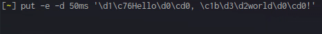

# Put

[](https://app.codacy.com/app/unlimiter/put?utm_source=github.com&utm_medium=referral&utm_content=Unlimiter/put&utm_campaign=Badge_Grade_Dashboard)


A pretty text printer.

## Description

Put is a tool written in C++ for writing text to the standard output in a stylish way.

## Installation

Install the Put repository using `git clone`.

```bash
git clone https://github.com/Unlimiter/put
```

To compile Put, type the command `make` while on the repository directory. This will generate the `put` binary.

And to open the manpage for Put, first you need to `sudo make install`, then you can `man put` to open the manpage.

## Usage

`put [-Eehnv] [-d <time>] [-t <time>] [<argument>...]`

### Example



For a complete usage reference, see the file `USAGE.txt` or run `put -h`. For a quick reference, see [the wiki](https://github.com/Unlimiter/put/wiki).

## Contributing

You can help by:
- improving code
- keeping files updated
- opening an issue

Any kind of help is appreciated.

## Chat

**IRC**: Join ##put on Freenode.

## Getting help
If you experience any problem with this repository, please open an issue.

If the problem is related to git, please check [here](https://git-scm.com/community).

## License
[MIT License](https://choosealicense.com/licenses/mit/)
